# Project Workflow

We execute these steps in order create a yearly land cover product for a given year and region in KAZA 

1. Create Land Cover Reference Polygons using GEE and Collect Earth Online
2. Create Sentinel-2 Input Band Stack
3. Extract Training and Testing Point information from the Sentinel-2 Stack inside Reference Polygons
4. Create Land Cover Primitives
5. Assemble Land Cover Map
6. Area Estimation and Accuracy 

For tool documentation, see the [REAMDE](README.md)

## Detailed Example

Below is a full run-through of the process, with CLI usage examples, screenshots, and guidance using a small test area within the Binga community AOI.

### Step 1. Create Land Cover Reference Polygons using GEE and Collect Earth Online

#### Step 1a. Export Stratified Random Sample Points from GEE

In order to create an independently-derived reference polygon dataset for land cover modeling, we need to first export a stratified random sample dataset, using a pre-existing and trusted Land Cover map. This way we can guide the reference data interpretion process so that enough samples are derived per land cover class. 

Below is a Land Cover image for our area already existing in our GEE Assets at this file path: `projects/wwf-sig/assets/kaza-lc/output_landcover/LandCover_BingaTestPoly_2020`.

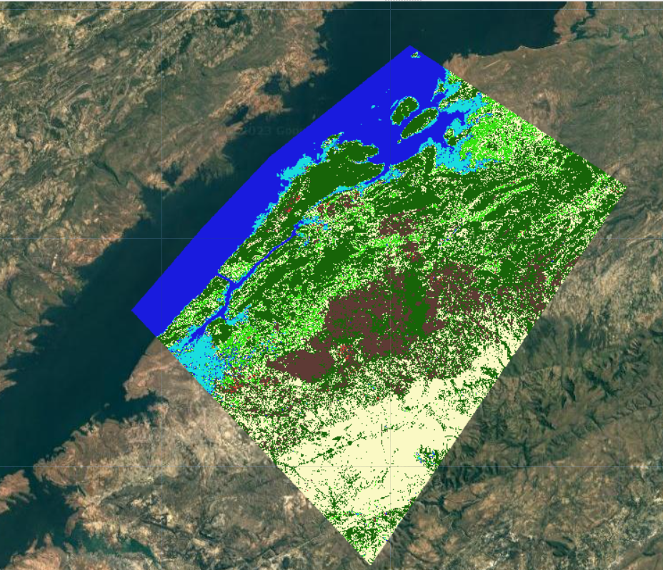

* Run the 00sample_pts script, providing a reference land cover image, its land cover band name, and your desired sample stratification options. By default the tool will export the point dataset to Google Drive a CSV and as a GEE FeatureCollection Asset. 

CLI Input:

```
00sample_pts -im projects/wwf-sig/assets/kaza-lc/output_landcover/LandCover_BingaTestPoly_2020 -band classification -o projects/wwf-sig/assets/kaza-lc/sample_pts/demo_LandCover_BingaTestPoly_2020 --class_values 1 2 3 4 5 6 7 8 --class_points 100 200 200 100 100 100 100 100
```

CLI Output:

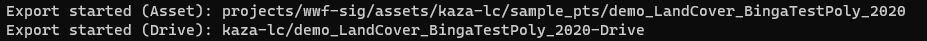

GEE Task Pane:

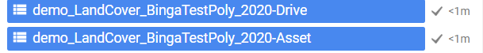

GEE Asset Display:

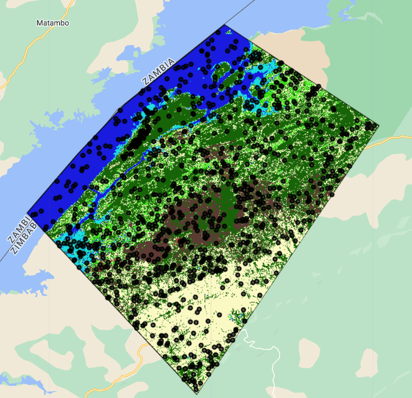

**For the following Collect Earth Online step, we need the sample points CSV that was exported to Google Drive** 

#### Step 1b. Collect Reference Polygons in CEO

We will now use the sample point CSV data exported from Step 1a in the creation of a reference data interpretation project in Collect Earth Online.

Create New Data Collection Project:
1. Download the sample points CSV from Google Drive
2. Go to https://collect.earth and sign in
3. Click the WWF Institution
4. Create a new project
5. Make your data collection configuration settings to your liking
6. On the Sample Plot page of the survey editor wizard, upload your CSV file as the plots.

Collect Land Cover Reference Polygons in CEO:

*Refer to the WWF CEO Data Collection document for further instructions and best practices*

#### Step 1c. Upload CEO-derived Reference Polygons to GEE:
1. Export the completed survey data out of Collect Earth Online as a CSV. 
2. In the GEE Code Editor (code.earthengine.google.com), in the Assets tab at the top-left, click New and select CSV file (.csv) under Table Upload.
3. Select the source file from your computer, edit the GEE asset path, and click Upload.

GEE Asset Display:

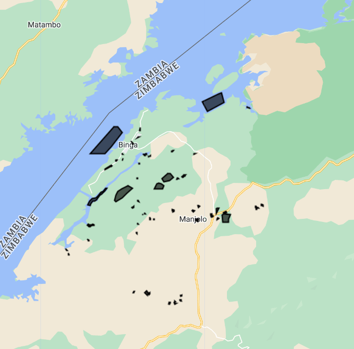

### Step 2. Create Sentinel-2 Input Stack

We need to composite information from Sentinel-2 and other geospatial data sources that the land cover model will be using to train and predict on land cover. To be most memory-efficient, we must export a given Sentinel-2 Input Stack to a GEE asset before using it in either the training data generation or model prediction steps. You can create S2 input stack for any year of interest to any AOI polygon or set of polygons. 

I interpreted my Land Cover Reference Polygons for the year 2022 in Collect Earth Online, and I want to predict a 2022 land cover map, so I will create a 2022 Sentinel-2 input stack composite using the `01sentinel2_sr` tool. Since my reference polygons in this demo all fall within my desired project AOI and my training data and prediction year is the same, I can run this tool once for my project AOI, and use the result of that for both the training data creation and model prediction steps*. If I wanted to create training data from 2021 to train the model and predict 2022 land cover, I would need to run `01sentinel2_sr` tool twice - once for 2021 training data and once for 2022 prediction. 

* Run the `01composite_s2` tool, specifying an AOI GEE asset path, the year to composite data for, and an output GEE asset path

CLI Input:
```
01composite_s2 -a projects/wwf-sig/assets/kaza-lc/aoi/testBingaPoly -y 2022 -o projects/wwf-sig/assets/kaza-lc/input_stacks/S2_2022_testBingaPoly
```

CLI Output:

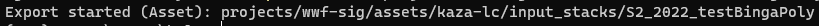

**If my reference polygons overlap multiple project AOIs or fall outside of them (i.e. WWF's Zambia Field Data), then compositing S2 data with wall-to-wall coverage of the the reference polygons' bounding box (the default behavior) wastes compute resources - we won't use any of the composited data that is outside the reference polygon footprints and outside any of the AOIs. It is more efficient to composite S2 data just within the polygon footprints and use that data to extract training information within those footprints. In that instance, you would provide the reference polygons Asset path to the -a/--aoi flag and provide the -p/--polygons flag in this tool to composite data only within polygon footprints instead. Therefore, you would need to run the `01composite_s2` tool twice - once to provide an input stack for the training data creation and again to provide an input stack within your project AOI for the land cover prediction.* 

GEE Task Pane:

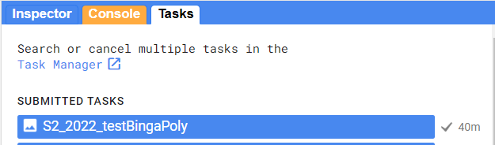

GEE Asset Display (visualization: red, green, and blue 50th percentile bands):

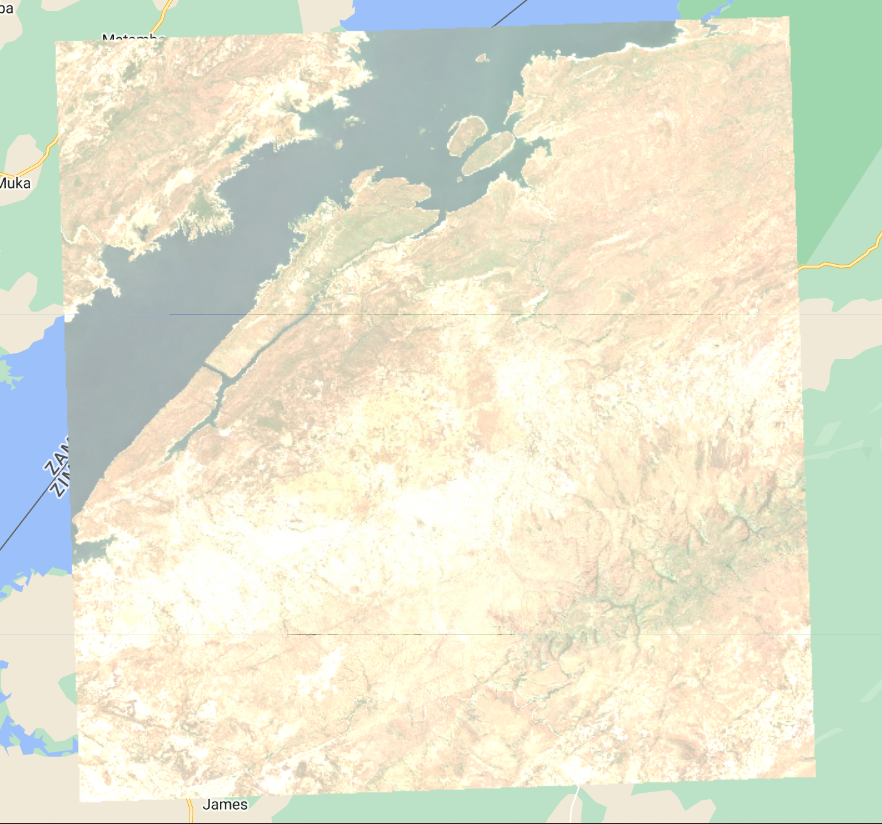

__A Note for Continued Research & Development__

All spectral bands and time series features are controlled by the user in the [`src/utils/model_inputs.py`](src/utils/model_inputs.py) file. 


The settings in this file currently reflect those model covariates detailed in the methodology report, but we fully expect for WWF to begin experimenting with feature engineering for model performance improvements. Computing harmonic trend coefficients on user-controlled spectral bands and indices is also now supported. Set `addHarmonics` to True to use them. In `harmonicsOptions`, the user specifies which band/spectral index and Day of Year range to compute the harmonic trend coefficients from.

Currently `addJRCWater` and `addTasselCap` are set to `False`. These covariates were previously not coded into the toolset. It is highly likely that they will be informative model covariates for a variety of land cover classes. For more information on the science behind these covariates, see:

[JRC GEE Dataset (with link to paper)](https://developers.google.com/earth-engine/datasets/catalog/JRC_GSW1_4_GlobalSurfaceWater)

[Tasseled Cap paper](https://doi.org/10.1109/JSTARS.2019.2938388)

*Ensure that at the time of running all script tools, the settings in model_inputs.py were the same, otherwise you will get errors at the model training and/or prediction stage due to inconsistent list of inputs.* 

### Step 3. Extract Training and Testing Data from Reference Polygons

Now that I have a Sentine-2 Input Stack composited and exported to a GEE Asset, I can use it in conjunction with my reference polygon dataset to extract a stratified random sample of training and test points that contain all the necessary model predictors and the Land Cover label. I provide my reference polygon asset, my S2 input image, and set my stratified sampling configuration. Here I'm sampling between 500 and 1000 points per land cover class.  

* Run the `02train_test` tool, providing the reference polygon asset path, the input stack image path, your output asset path basename (the tool adds '_train_pts' and '_test_pts' suffixes to the output file path provided), and specifying your stratified sampling configuration.

CLI Input:
```
02train_test -rp projects/wwf-sig/assets/kaza-lc/reference_data/BingaDummyReferencePolys -im projects/wwf-sig/assets/kaza-lc/input_stacks/S2_2022_testBingaPoly -o projects/wwf-sig/assets/kaza-lc/sample_pts/BingaDummyReferencePolys_S2_2022_testBingaPoly --class_values 1 2 3 4 5 6 7 8 --class_points 500 500 1000 750 750 750 500 500
```

CLI Output:

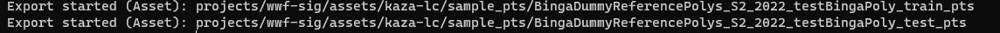

GEE Task:

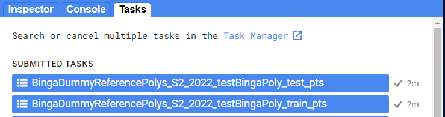

GEE Asset Display:

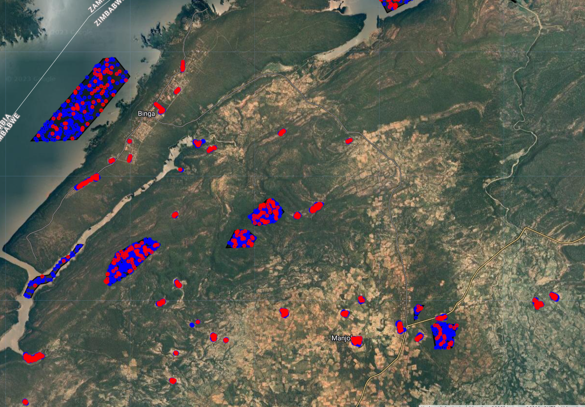

### Step 4. Create Land Cover Primitives

I have training data for a model and I have the input stack that I want to have the model predict on, so I am ready to run my Primitives modeling tool. This tool generates probability Random Forest models for every land cover class in the land cover stratification, then uses the trained model to predict each land cover class on the input S2 stack provided. We call each of these land cover probability outputs 'Primitives'. When inspecting the output in the Code Editor, you can view the pixel as a histogram of probabilities for each Class. In the next step we assemble these primitives into a final Land Cover image.

Note this tool also exports one out of bag (OOB) error .txt file and one varImportance .csv file per primitive. The oobError .txt files contain the Out-of-Bag Error estimate for that primitive's Random Forest model. The varImportance .csv files report out the relative importance of **each of the top 20 most important input features (covariates)**. Those files are saved locally to a metrics folder in your current working directory. 

* Run the `03RFprimitives` tool, providing the input S2 stack path, the training points asset path, and an output path.

**Note: the -t --training_data flag can accept multiple training dataset paths separated by a space. Therefore you can use multiple training datasets, generated from different years and/or locations to train the model. This addresses WWF's desire to apply reference data from other years and locations to a given project AOI's yearly land cover maps. See the explanation within Step 2 regarding this scenario.**

CLI Input:
```
03RFprimitives -i projects/wwf-sig/assets/kaza-lc/input_stacks/S2_2022_testBingaPoly -t projects/wwf-sig/assets/kaza-lc/sample_pts/BingaDummyReferencePolys_S2_2022_testBingaPoly_train_pts -o projects/wwf-sig/assets/kaza-lc/output_landcover/Primitives_S2_2022_testBingaPoly
```

CLI Output:


Metrics Outputs:

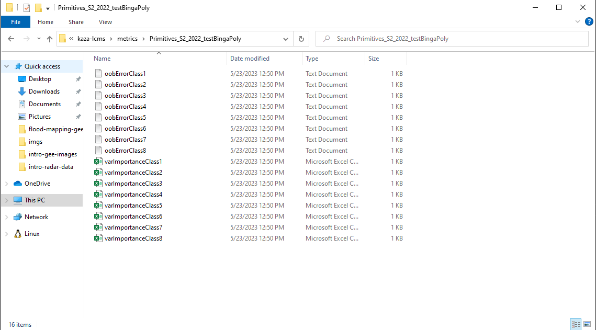

GEE Task:

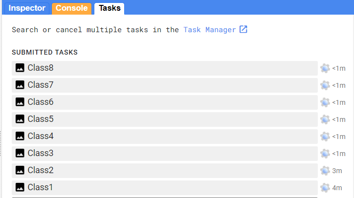

GEE Asset Display:

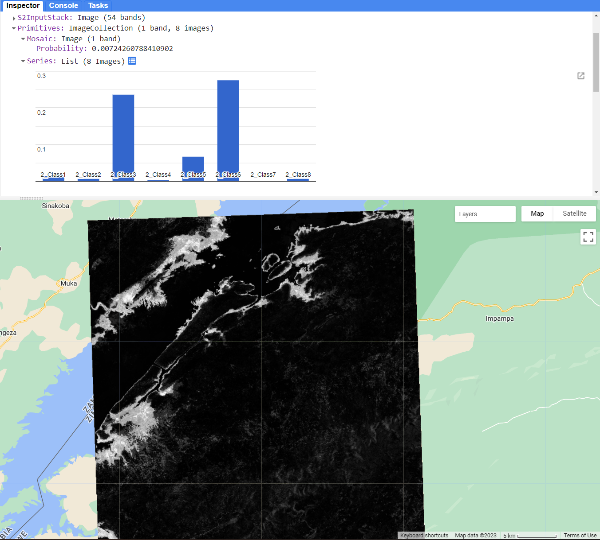

__A Note for Continued Research & Development__

The OOB and varImportance metrics exported by this tool can aid in assessing model improvement efforts through feature engineering. After changing the input features for your model (in the [model_inputs.py](src/utils/model_inputs.py) file, see Step 2), we would want to see lower OOB errors and your new input features showing up in the variable importance CSVs.

### Step 5. Assemble Land Cover Map

Now that we have generated our Primitives for our Land Cover typology, we want to assemble the primitives into a categorical Land Cover image. In the current methodology, the assemblage rule(s) are simple: for each pixel, the final Land Cover category is that primitive with the highest probability value. 

* Run the `04generate_LC` tool, providing the input primitives ImageCollection path and an output asset path.

CLI Input:
```
04generate_LC -i projects/wwf-sig/assets/kaza-lc/output_landcover/Primitives_S2_2022_testBingaPoly -o projects/wwf-sig/assets/kaza-lc/output_landcover/LandCover_S2_2022_testBingaPoly
```
CLI Output:


GEE Task:

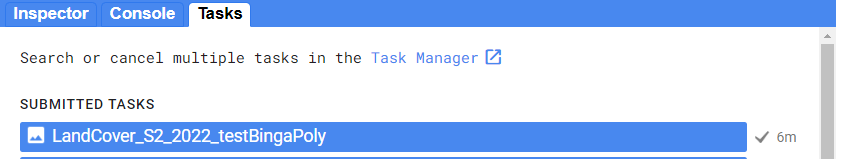

GEE Asset Display:

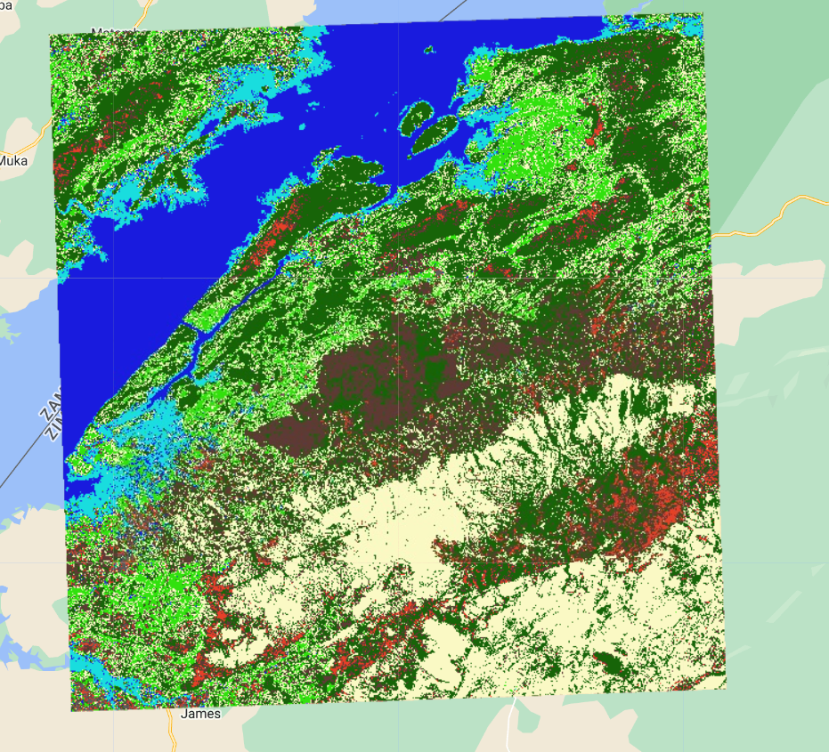


**Inspecting Outputs**

In addition to digging into the files in your metrics folders, you should also look at the output land cover image to gain insight into how the land cover models are performing
In the [code editor](https://code.earthengine.google.com/), in a new script, copy this code block in to the code pane:

```javascript
var landcover = ee.Image("path/to/landcover/image")
var lc_pal = [
    "#5C5B5B", // bare - grey
    "#E74029", // built - red
    "#5E3A35", // crop - brown
    "#176408", // forest - dark green
    "#FAF9C4", // grass - yellow
    "#31E10E", // shrub - light green
    "#191BDE", // water - dark blue 
    "#19DDDE"]; // wetland - light blue
    
var lc_vis = {min:1,max:8,palette:lc_pal};
Map.addLayer(landcover,lc_vis,'Land Cover')
```

On the first line, replace the string asset path to your actual Land Cover ee.Image path. 

You can zoom in, and change the transparency of layers in the Layers widget in the top-right of the Map window. Feel free to use any other hex string color code to change the class colors. 

### Step 6. Area Estimation and Accuracy 

**Accuracy Assessment and Area Estimation using [AREA2](https://area2.readthedocs.io/en/latest/overview.html)**

Once you have a final Land Cover ee.Image in your Earth Engine folder, you are ready to assess its accuracy and estimate area per class from that image.
__click this link to add the AREA2 GEE script repository to your Reader repos: [https://code.earthengine.google.com/?accept_repo=projects/AREA2/public](https://code.earthengine.google.com/?accept_repo=projects/AREA2/public)__
We will be using the `Stratified Estimation` script tool. 


* Open the script and click `Run`. A User Interface will be generated.


* In the first dialog box, we will provide the full GEE asset path to our Land Cover `ee.Image`.
* We leave the second dialog box, 'Specify Band' as default 1
* In the third dialog box, we must specify the no data value. It must be a number that is not being used in the 'LANDCOVER' typology. For example, if your LANDCOVER values are 1-8, a no data value 0 is appropriate.
* In the fourth dialog box, we provide the full GEE asset path to our testing samples `ee.FeatureCollection`. In our workflow, this is generated in the 03RFprimitives.py by separating the input reference data into '_trainingPts' and '_testingPts'. You want to select the '_testingPts' `ee.FeatureCollection`
* Click 'Load data', then another button 'Apply stratified estimator' will appear. Click that as well. 
* Testing points that were misclassified in our land cover image are added to the map, and Accuracy and Area metrics are printed to the Console. 


* You can save or take a screenshot of the printed Accuracy and Area metrics. You can also retrieve the confusion/error matrices themselves as total counts or proportions by clicking the 'show error matrices' button in the UI. 

*A good place to save these metrics is in the metrics subfolder generated during the RF Primitives analysis.*


