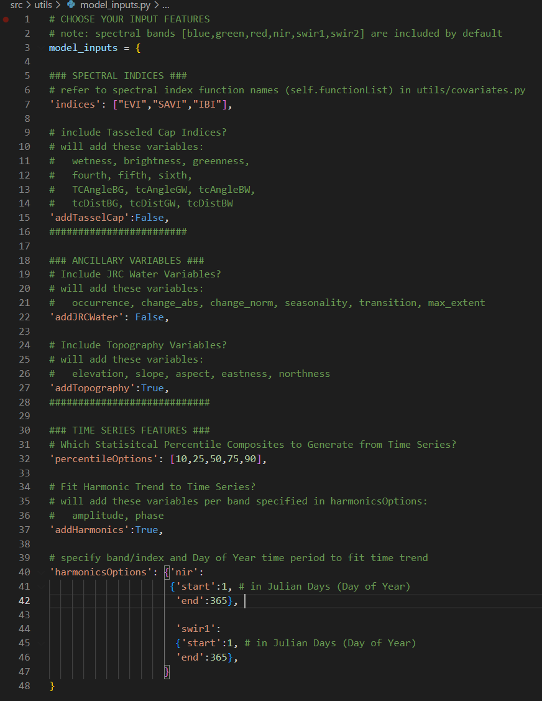
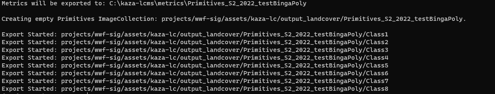
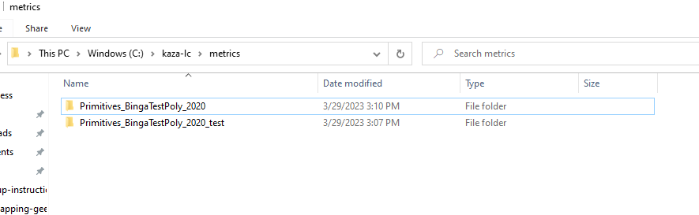
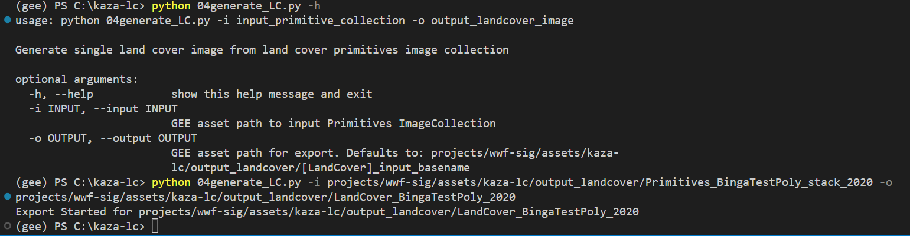
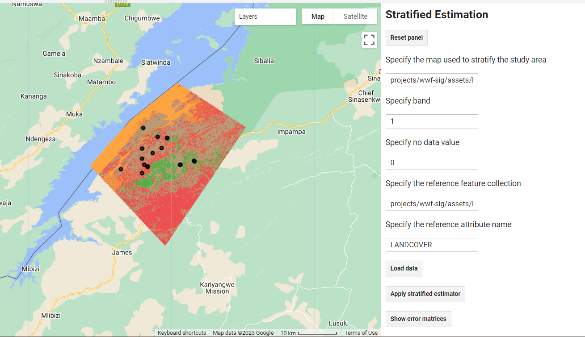
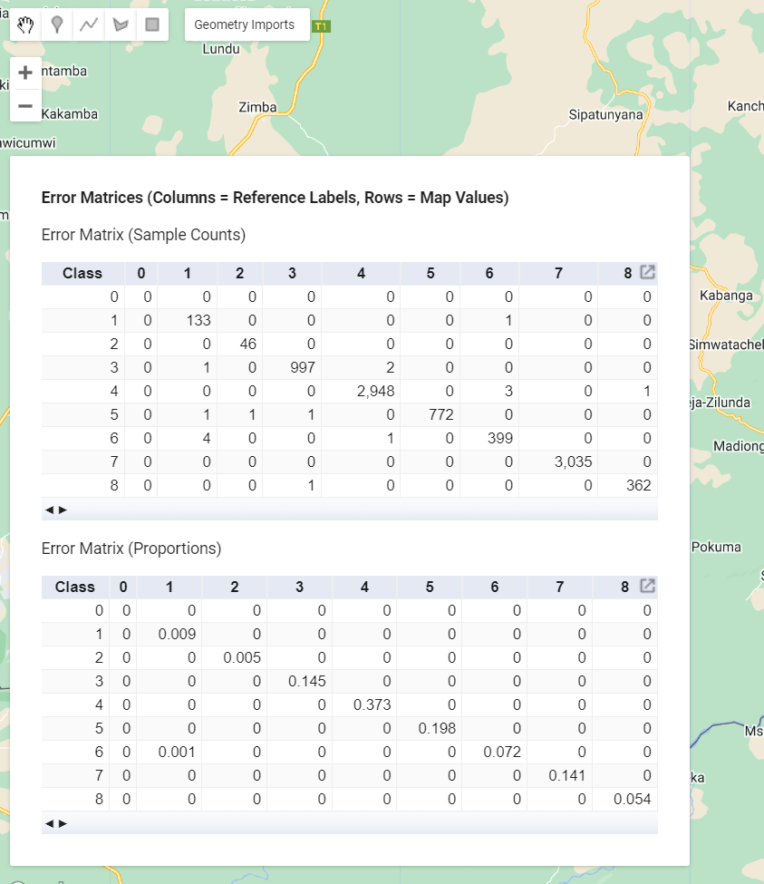

# Project Workflow

Probably will remove these links and visualizing LC outputs will paste a JS code block of a Code Link in this documentation.

**click this link to accept the kazaLC Javascript repo: https://code.earthengine.google.com/?accept_repo=users/kwoodward/kazaLC**

**click this link to gain access to the WWF_KAZA Google Drive folder: https://drive.google.com/drive/folders/1Qd3Xo9ISQjQV15xxwqfgE-Dr1JFJ49M4?usp=sharing**

Execute these steps in order create a yearly land cover product for a given year and region in KAZA 
*(tool in parentheses)*

1. Generate Random Land Cover Samples
2. Collect Reference Polygons in CEO
3. Create Sentinel-2 Input Stack
4. Generate Train and Test Data
5. Create Land Cover Primitives
6. Assemble Land Cover Map
7. Area Estimation and Accuracy 

## Detailed Example

Here is a full run-through of the process, with CLI usage examples, screenshots, and guidance.

### Generate Random Land Cover Samples

### Collect Reference Polygons in CEO

Refer to the WWF CEO Data Collection document for instructions

### Create Sentinel-2 Input Stack

To continue the Research & Development process, all spectral bands and time series features are controlled by the user in the `src/utils/model_inputs.py` file in this repository. 

The settings in this file currently reflect those model covariates detailed in the methodology report, but we fully expect for WWF to begin experimenting with feature engineering for model performance improvements. Computing harmonic trend coefficients on user-controlled spectral bands and indices is also now supported. Set `addHarmonics` to True to use them. In `harmonicsOptions`, the user specifies which band/spectral index and Day of Year range to compute the harmonic trend coefficients from.

Currently `addJRCWater` and `addTasselCap` are set to `False`. These covariates were previously not coded into the toolset. It is highly likely that they will be informative model covariates for a variety of land cover classes. For more information on the science behind these covariates, see these papers:

[JRC paper]()

[TasselCap paper]()

The script reports that it is exporting a new dataset to the Earth Engine project. You can monitor submitted Earth Engine tasks in the [code editor](https://code.earthengine.google.com/) and clicking on Tasks tab in top-right

Once the export task has completed, confirm that the new dataset exists. In the [code editor](https://code.earthengine.google.com/), go to Assets tab on top-left and navigate to the `wwf-sig` cloud project folder. Find the dataset at the path that was reported in the previous script.

### Generate Train and Test Data

### Create Land Cover Primitives

Once the script completes, check several things:
1. Check that the exports have been submitted by looking at the Tasks tab in the [code editor](https://code.earthengine.google.com/)

2. Go into your local `kaza-lc` folder on your computer, check that a new folder named at the reported location has been created. In the example above the folder was named `C:\kaza-lc\metrics\Primitives_BingaTestPoly_2020`.
3. Investigate the metric files located within. 

There should be one oobError .txt file and one varImportance .csv file per land cover. The oobError .txt files contain the Out-of-Bag Error estimate for that land cover's Random Forest model. The varImportance .csv files report out the relative importance of each input feature (covariate) in the input data stack.

### Assemble Land Cover Map

Like you've done previously, check that the export task has been submitted in the [code editor](https://code.earthengine.google.com/), and when the task completes, check that the new output file exists in the Assets tab. 

# Inspecting Outputs
In addition to digging into the files in your metrics folders, you should also look at the output land cover image to gain insight into how the land cover models are performing
In the [code editor](https://code.earthengine.google.com/), in the Scripts tab top-left, find the code repository named 'users/kwoodward/inspectingLCOutputs' and open it. Edit it as necessary to display the land cover products you would like to look at and click Run.

You can zoom in, and change the transparency of layers in the Layers widget in the top-right of the Map window.

### Area Estimation and Accuracy 

**Accuracy Assessment and Area Estimation using [AREA2](https://area2.readthedocs.io/en/latest/overview.html)**

Once you have a final Land Cover ee.Image in your Earth Engine folder, you are ready to assess its accuracy and estimate area per class from that image.
__click this link to add the AREA2 GEE script repository to your Reader repos: [https://code.earthengine.google.com/?accept_repo=projects/AREA2/public](https://code.earthengine.google.com/?accept_repo=projects/AREA2/public)__
We will be using the `Stratified Estimation` script tool. 

* Open the script and click `Run`. A User Interface will be generated.

* In the first dialog box, we will provide the full GEE asset path to our Land Cover `ee.Image`.
* We leave the second dialog box, 'Specify Band' as default 1
* In the third dialog box, we must specify the no data value. It must be a number that is not being used in the 'LANDCOVER' typology. For example, if your LANDCOVER values are 1-8, a no data value 0 is appropriate.
* In the fourth dialog box, we provide the full GEE asset path to our testing samples `ee.FeatureCollection`. In our workflow, this is generated in the 03RFprimitives.py by separating the input reference data into '_trainingPts' and '_testingPts'. You want to select the '_testingPts' `ee.FeatureCollection`
* Click 'Load data', then another button 'Apply stratified estimator' will appear. Click that as well. 
* Testing points that were misclassified in our land cover image are added to the map, and Accuracy and Area metrics are printed to the Console. 

* You can save or take a screenshot of the printed Accuracy and Area metrics. You can also retrieve the confusion/error matrices themselves as total counts or proportions by clicking the 'show error matrices' button in the UI. 

*A good place to save these metrics is in the metrics subfolder generated during the RF Primitives analysis.*

