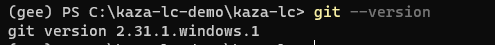
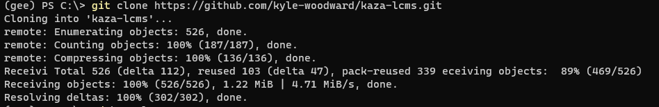
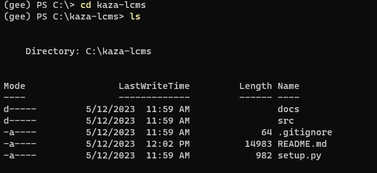
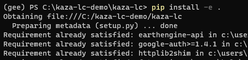
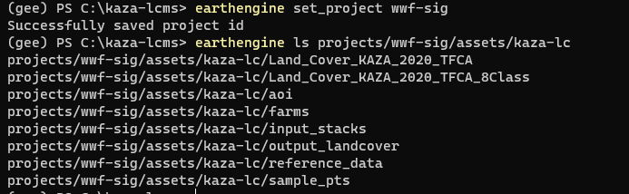

# Running KAZA Regional Land Cover Monitoring System
# Setup Instructions
## Python Environment Setup
1. Install Anaconda 
* Go to the Anaconda distribution [page](https://www.anaconda.com/products/distribution), scroll to the bottom and find the Anaconda installer file for your Operating System. 
* Run the installer .exe and follow all recommendations in the installer. This [installation docs page](https://docs.anaconda.com/anaconda/install/) provides step-by-step guidance depending on your OS and use-case.
* When Anaconda asks you "Do you wish the installer to initialize Anaconda3?" Say Yes
2. Test your Anaconda Installation
* Open your command-prompt/shell/terminal and type `conda list`. You should see something like this.


* notice we're in the `base` environment by default, as indicated by the command-line. We want to operate from a custom python environment.
3. Create a custom virtual environment
Keep your shell open and paste each one of these commands.
* Create a new conda env named 'gee'
```
conda create -n gee 
```
* Activate your new 'gee' env
```
conda activate gee
```
* Leave this environment activated, we will install necessary packages from the `kaza-lc` source code in the next section. 

## Git Setup
1. Download the Git installer for your OS from the Git downloads [page](https://git-scm.com/downloads). Run the installer following all recommended settings
2. Once installation is complete, open your command prompt/shell/terminal and type 
```
git --version
```



3. Clone the repository to a local folder 

```
git clone https://github.com/kyle-woodward/kaza-lcms.git
```



4. `cd` into your new kaza-lcms folder and `ls`(linux/MacOS) or `dir`(Windows) to see its contents



## Install Source Code and Dependencies
1. While still in your terminal, and in the `kaza-lcms` parent directory, install the `kaza-lcms` package from the source code with pip:

```
pip install -e .
```



pip will begin to install the `kaza-lcms` source code and its required dependencies. We install the package in developer mode (`-e` flag) so that changes made to files will be reflected in the code compiled at run-time. If the python package dependencies are already installed in your conda `gee` virtual environment, your output will show 'requirement already satisfied' next to each package already installed. 

## Earth Engine Setup
Earth Engine requires you to authenticate your account credentials to access the Earth Engine API and your chosen Cloud Project. We do this with the `gcloud` python utility
1. Download the installer for the `glcoud` command-line python [utility](https://cloud.google.com/sdk/docs/install) from Google
2. Run the installer
3. Select Single User and use the default Destination Folder
4. Leave the Selected Components to Install as-is and click Install
5. Leave all four boxes checked, and click Finish. This will open a new command-prompt window and auto run gcloud initialization
6. It asks whether yo'd like to log in, type y - this will open a new browser window to a Google Authentication page


7. Choose your Google account that is linked to your Earth Engine account, then click Allow on the next page.


8. You will be redirected to a page that says "You are now authenticated with the gcloud CLI!"
9. Go back to your shell that had been opened for you by gcloud. It asks you to choose a cloud project and lists all available cloud projects that your google account has access to. Look for `wwf-sig` and then type the number it is listed as to set your project. 


10. Back in your separate shell window, first ensure you are in your custom conda env (running `conda activate env-name`), then run:
```
earthengine authenticate
```
11. In the browser window that opens, select the Google account that is tied to your EE account, select the wwf-sig cloud project, then click Generate Token at the bottom of the page.
12. On the next page, select your Google account again, then click Allow on the next page.
13. Copy the authorization token it generates to your clipboard and back in your shell, paste it and hit Enter. 

# Testing Your Setup
Test that earthengine is setup and authenticated by checking the folder contents within the `wwf-sig` cloud project. 
* In your shell, run:
```
earthengine set project wwf-sig
earthengine ls projects/wwf-sig/assets/kaza-lc
```



If you do not get an error and it returns a list of folders and assets similar to this then you are good to go! :tada:

# Tool Documentation

Before you run any scripts, ensure you've activated your anaconda environment with your required dependencies and have changed into the `kaza-lcms` directory that contains the scripts.
example:
```
conda activate gee
cd C:\kaza-lcms
```

Each Command Line Interface (CLI) script tool can be run in your command-line terminal of choice. The user must provide values for each required command-line argument to control the analysis.
You can first run any script, only declaring the `-h` flag. This will bring up the help dialog with a usage example and a description of required command-line arguments. 

## **00sample_pts**

Generate Random Sample Points From an ee.Image, Formatted for Collect Earth Online

The points are pre-formatted for use in Collect Earth Online to generate photo-interpreted reference data. You can choose to export the points to Google Drive, to GEE Asset or both. 

example:
```
00sample_pts -im input/path/to/image -band LANDCOVER -o output/path --n_points 100 --to_drive
```

## **01sentinel2_sr**

Creates a Sentinel-2 Composite for an AOI or reference polygons. 

The resulting band stack is needed for both extracting training data information and as input to a trained model's inference. Set the `-p` flag if your AOI is a set of reference polygons and not one contiguous AOI polygon. 

example:
```
01composite_s2 -a Zambezi -y 2021 -o projects/wwf-sig/assets/kaza-lc-test/input_stacks
```

**NOTE: The user can control which spectral indices and time series features to generate in this tool by modifying this file in the repository : [`~/src/utils/model_inputs.py`](/src/utils/model_inputs.py). See [ProjectWorkflow.md](/ProjectWorkflow.md) for details.**

## **03RFprimitives**

Create Land Cover Primitives For All Classes in Provided Training Data. 

This script trains probability Random Forest models for each land cover class in your typology as provided by the numeric 'LANDCOVER' property in the provided reference data. It then exports these binary probability images one land cover at a time into a land cover 'Primitives' image collection. While doing so, it also reports out some model performance metrics saved to a new folder created in your *local* `kaza-lcms/metrics` folder on your computer.

example:
```
03RFprimitives -i projects/wwf-sig/assets/kaza-lc/input_stacks/BingaTestPoly_stack_2020 -r projects/wwf-sig/assets/kaza-lc/sample_pts/BingaDummyReferenceData  -o projects/wwf-sig/assets/kaza-lc/output_landcover/Primitives_BingaTestPoly_2020
```

## **04generate_LC**

Generate Single Land Cover Image From Land Cover Primitives Image Collection

This script takes the RF primitives collection generated from the previous script and creates a single-band land cover image from them, taking the highest-probability Primitive at each pixel to assign the Land Cover class.

example:
```
04generate_LC -i projects/wwf-sig/assets/kaza-lc/output_landcover/Primitives_BingaTestPoly_stack_2020 -o 
projects/wwf-sig/assets/kaza-lc/output_landcover/LandCover_BingaTestPoly_2020
```


